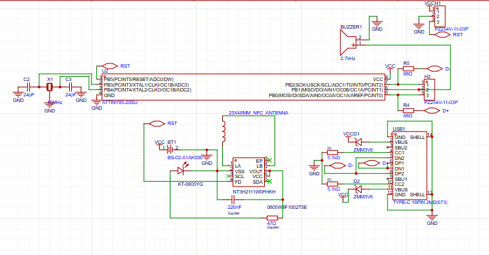
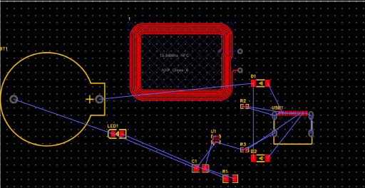
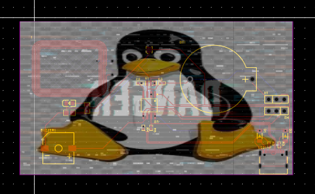
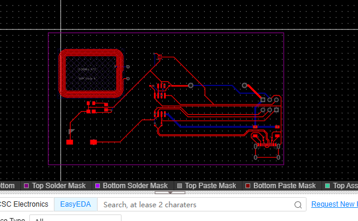

# June 20th: Finished Schematic

Finished the schmeatic it was pretty easy just took time to search for parts and getting used to easy eda pro

**Time spent: 2h**

# June 22th: Tried laying parts(failed)

Started working on the pcb but left quickly as I felt like not doing as EASY EDA is just messing with me 
I tried to wire things but it all went to vain idk why there is no autosave :sob:

**Time spent: 50min**

# June 24th: Finally did the PCB yay

Finished it. I just need to get used to this
As an PRO Kicad Supporter, I need some more time to properly get used to this but yea
here is the pcb tho.. I didnt truly did the impedance thing for USB +/-
Its a rough skeetch thing now 

**Time spent: 3 & 1/2 hr**

# June 25th: Did the routing more polished(?)

Started working on the pcb but left quickly as I felt like not doing as EASY EDA is just messing with me 
I tried to wire things but it all went to vain idk why there is no autosave :sob:

**Time spent: 30min**
